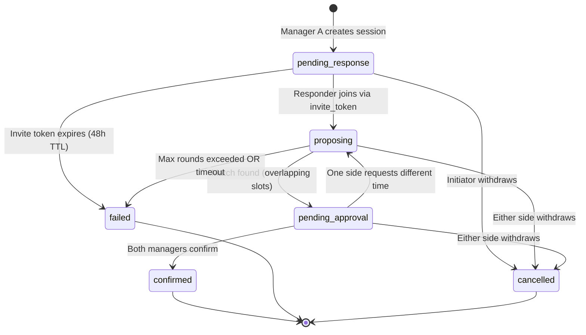
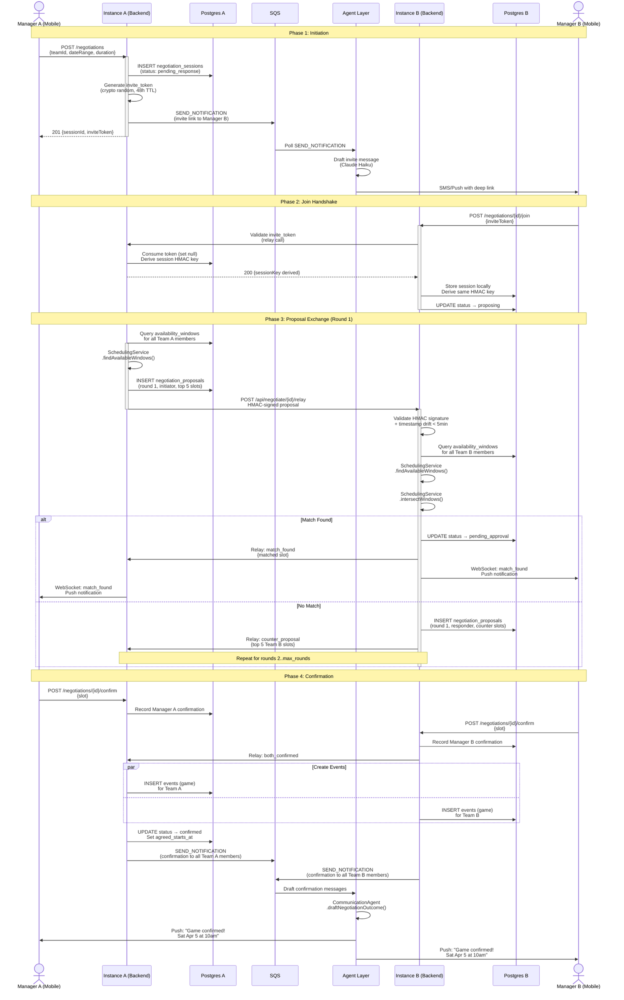
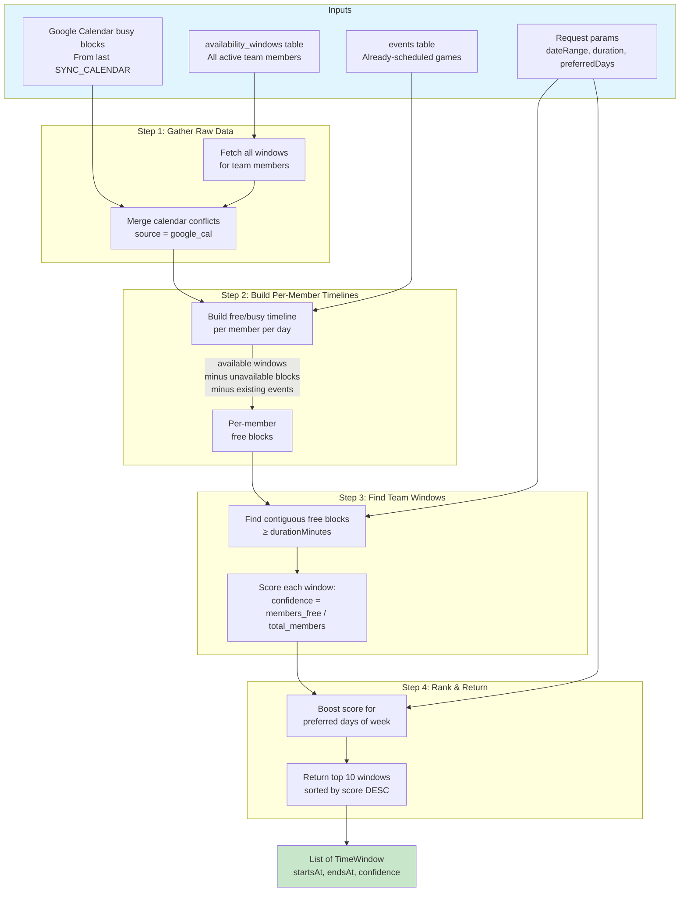
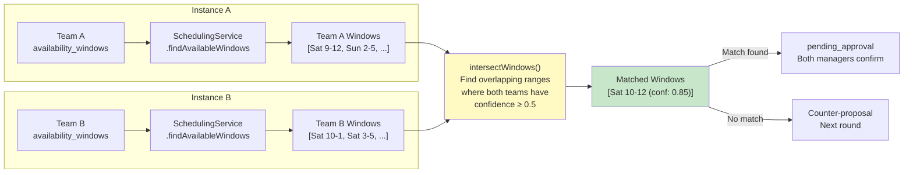
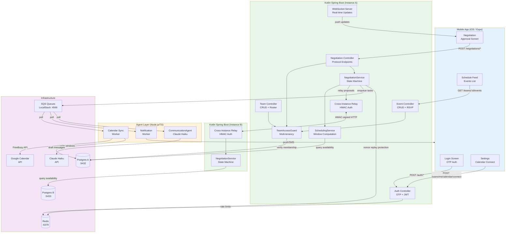
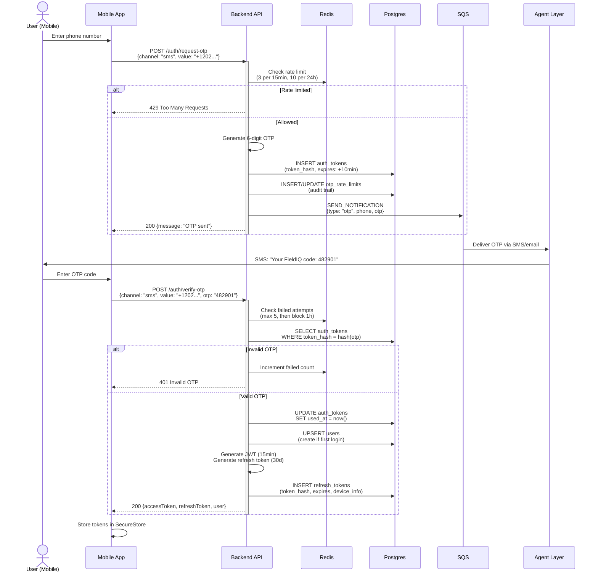
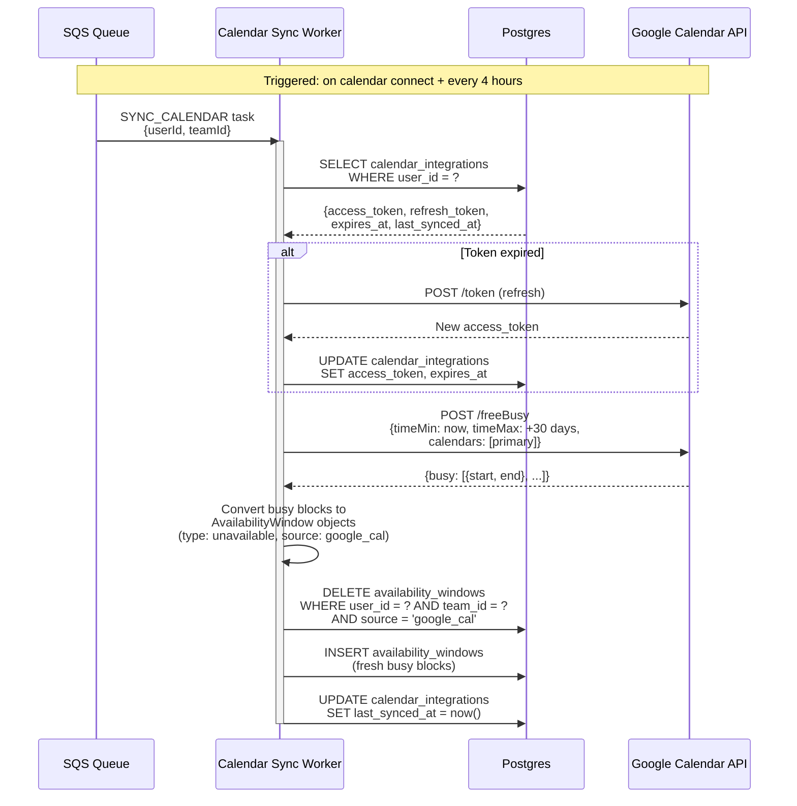
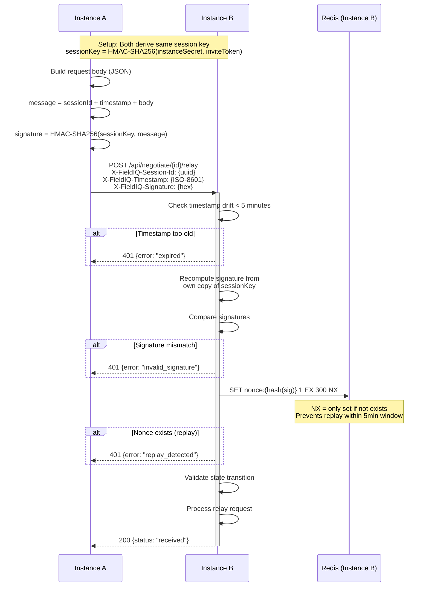
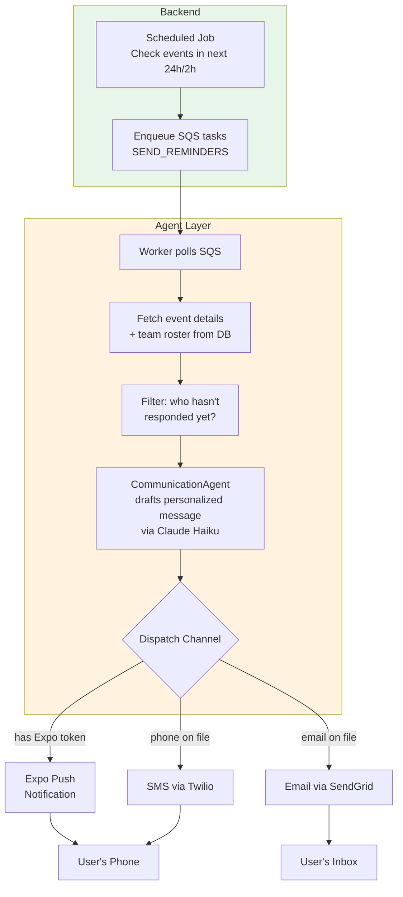

# FieldIQ — Architecture Diagrams

Mermaid diagrams for the core system flows. Renders natively on GitHub.

---

## 1. Negotiation Protocol — State Machine

All valid state transitions for a `NegotiationSession`. Terminal states are double-bordered.

---

## 2. Negotiation Protocol — Full Sequence Diagram (Happy Path)

End-to-end flow from initiation to confirmed game, across two FieldIQ instances.

---

## 3. Scheduling Service — Window Computation Data Flow

How `SchedulingService.findAvailableWindows()` computes optimal meeting times.

---

## 4. Cross-Team Window Intersection

How `SchedulingService.intersectWindows()` finds mutually available times.

---

## 5. System Architecture — Component Overview

High-level view of all components and how they communicate.

---

## 6. Authentication Flow — OTP + JWT

Passwordless login flow from mobile app to backend.

---

## 7. Calendar Sync — Data Flow

How Google Calendar busy blocks become availability windows.

---

## 8. HMAC Cross-Instance Authentication

How two FieldIQ instances authenticate relay requests.

---

## 9. Notification Dispatch — Event Reminder Flow

How the system sends reminders 24h and 2h before events.

